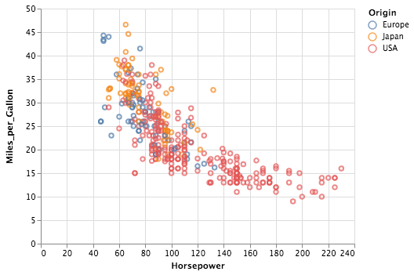

<!-- README.md is generated from README.Rmd. Please edit that file -->

```{r setup, include = FALSE}
knitr::opts_chunk$set(
  collapse = TRUE,
  comment = "#>",
  fig.path = "man/figures/README-",
  out.width = "100%"
)
```

[](https://www.tidyverse.org/lifecycle/#experimental)
[](https://cran.r-project.org/package=altair)
[](https://travis-ci.org/ijlyttle/altair)

# altair

The goal of altair is to help you build [Vega-Lite](https://vega.github.io/vega-lite) visualizations. Using the [**reticulate**](https://rstudio.github.io/reticulate) package, it provides an interface to the [Altair](https://altair-viz.github.io) Python package. This approach is different from efforts to build a native R interface to Vega-Lite, by Bob Rudis ([\@hrbrmstr](https://github.com/hrbrmstr)) and coworkers: the  [vegalite](https://github.com/hrbrmstr/vegalite) package, which has inspired this effort.

In this documentation, the capitalized word **Altair** shall refer to the Python package; the lower-case word **altair** shall refer to this R package.

## Installation

A development version is available from [GitHub](https://github.com/):

``` r
# install.packages("devtools")
devtools::install_github("ijlyttle/altair")
```

Because you are using a Python package, you may have some additional installation steps. These steps are described in greater detail in the  article [Field Guide to Python Issues](https://ijlyttle.github.io/altair/articles/field-guide-python.html).

1. Python must be installed on your system. To make things easier to work with reticulate, I recommend using a [Conda](https://conda.io/docs) installation; [Miniconda](https://conda.io/docs/user-guide/install/download.html#anaconda-or-miniconda) works well for me.

   Depending on how your system is configured, you may have to specify the location of your SSL cerificate, or deal with a proxy. [[reference](https://ijlyttle.github.io/altair/articles/field-guide-python.html/#reticulate-python)]

2. Create a Conda environment called `"r-reticulate"`. [[reference](https://ijlyttle.github.io/altair/articles/field-guide-python.html/#python-env)]

3. Install Altair into your `"r-reticulate"` environment using `altair::install_altair()`. [[reference](https://ijlyttle.github.io/altair/articles/field-guide-python.html/#altair)]

You may wish to add a line like this to the `.First()` function in your `.Rprofile`:

```r
reticulate::use_condaenv("r-reticulate")
```

This provides a hint to reticulate for which Python environment to use. [[reference](https://rstudio.github.io/reticulate/articles/versions.html#order-of-discovery)]

## Example

```{r example, eval=FALSE}
library("altair")

vega_data <- import_vega_data()

chart <- 
  alt$Chart(r_to_py(vega_data$cars()))$
  encode(
    x = "Horsepower:Q",
    y = "Miles_per_Gallon:Q",
    color = "Origin:N"
  )$
  mark_point()

chart
```



Some things to keep in mind:

  - Where you see a `.` in the Python examples, use a `$` instead.

  - Any data frames you provide as arguments need to wrapped by `r_to_py()`.

  - In your data, columns that contain dots can be wrapped in square brackets in Altair sppecifications, e.g. `[Sepal.Width]`, to keep Altair from throwing an error.

Also, it remains to sort out how to get the `vegawidget()` function to "do the right thing" when knitting to a non-html format, and to render inline in an RMarkdown notebook. 

## Development plan

For the foreseeable future, this package is going to be a bit rough. At the moment, you are able to muck around with Vega-Lite 2.0. This means:

1. You can create chart-specifications by accessing the Python **Altair** API using **reticulate**.
1. You can render a chart-specification into an htmlwidget, using `vegawidget()`.

There's really not much beyond that. In the near future, the thought is to focus on making this interface as robust as possible, perhaps to make it easier to consolidate datasets and publish [blocks](https://bl.ocks.org/).

In the longer-term future it may be interesting to provide a proper R interface to the Python API; there are already some [encouraging first steps](https://github.com/ijlyttle/altair/issues/15) towards this. This package has a [manifesto](https://ijlyttle.github.io/altair/articles/manifesto.html) to outline some high-level ideas.

## Articles

The documentation for this package includes some articles:

- [First Example](https://ijlyttle.github.io/altair/articles/first-example.html): A walkthrough to get a first chart to work.

- [Interactive Examples](https://ijlyttle.github.io/altair/articles/interactive.html): A set of examples that work towards linked-brushing of two scatterplots.

- [Tooltips](https://ijlyttle.github.io/altair/articles/tooltip.html): In the Vega world, tooltips are changing. Watch this space.

- [Vega Datasets](https://ijlyttle.github.io/altair/articles/vega-datasets.html): You can import [Vega datasets](https://github.com/altair-viz/vega_datasets) using `import_vega_data()`. 

- [Field Guide to Python Issues](https://ijlyttle.github.io/altair/articles/field-guide-python.html) As someone who is relatively new to Python, I am trying to keep track of "the unexpected" here.

- [Manifesto](https://ijlyttle.github.io/altair/articles/manifesto.html): A collection of ideas on where this package might go (and where it might want to avoid).

## Acknowledgements

This package does not contribute much beyond scaffolding; it rests on these foundations:

- [Altair](https://altair-viz.github.io): Python interface to Vega-Lite
- [Reticulate](https://rstudio.github.io/reticulate): R framework to work with Python
- [Vega-Lite](https://vega.github.io/vega-lite): A grammar of interactive graphics
- [D3](https://d3js.org): Data-driven documents
- [vegalite](https://github.com/hrbrmstr/vegalite): Native R interface to Vega-Lite

A particular debt is owed to the folks behind the [vegalite](https://github.com/hrbrmstr/vegalite) package, as it provided a lot of the inspiration for this package.

## Contributing

Please note that this project is released with a [Contributor Code of Conduct](CODE_OF_CONDUCT.md).
By participating in this project you agree to abide by its terms.

This project also has a [Contributing Guide](CONTRIBUTING.md).
