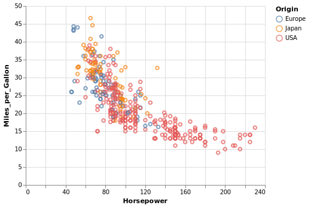

<!-- README.md is generated from README.Rmd. Please edit that file -->
<!-- badges: start -->

[](https://cran.r-project.org/package=altair)
[](https://github.com/vegawidget/altair/actions)
<!-- badges: end -->

# altair

The goal of altair is to help you build
[**Vega-Lite**](https://vega.github.io/vega-lite/) visualizations. This
package uses [**reticulate**](https://rstudio.github.io/reticulate/) to
provide an interface to the [**Altair**](https://altair-viz.github.io)
Python package, and the
[**vegawidget**](https://vegawidget.github.io/vegawidget/) package to
render charts as htmlwidgets. To avoid confusion, the capitalized word
**Altair** shall refer to the Python package; the lower-case word
**altair** shall refer to this R package.

This version of the R package supports Python Altair version 4.2.0.

## Example

This example is discussed in detail in our [Getting Started
article](https://vegawidget.github.io/altair/articles/altair.html):

``` r
library("altair")

vega_data <- import_vega_data()

chart <- 
  alt$Chart(vega_data$cars())$
  mark_point()$
  encode(
    x = "Horsepower:Q",
    y = "Miles_per_Gallon:Q",
    color = "Origin:N"
  )

chart
```

<!-- -->

Some things to keep in mind:

- Where you see a `.` in the Python examples, use a `$` instead.

- In your data, columns that contain dots can be wrapped in square
  brackets in Altair specifications, e.g. `[Sepal.Width]`, to keep
  Altair from throwing an error. Alternatively, you can use a
  double-backslash, e.g. `Sepal\\.Width`.

These and other “gotchas” are compiled along with workarounds in an
article: [Field Guide to Python
Issues](https://vegawidget.github.io/altair/articles/field-guide-python.html).

## Installation

You can install altair from CRAN with:

``` r
install.packages("altair")
```

The development version of is available from
[GitHub](https://github.com/vegawidget/altair/):

``` r
# install.packages("devtools")
devtools::install_github("vegawidget/altair") 
```

Because of Python, there may be some additional installation steps,
described in greater detail in the [Installation
article](https://vegawidget.github.io/altair/articles/installation.html).

1.  Python must be installed on your system. We have had success using
    [Conda](https://conda.io/docs): in particular,
    [Miniconda](https://conda.io/docs/user-guide/install/download.html#anaconda-or-miniconda)
    works well and installs more-quickly than Anaconda.

    If you work in a corporate or institutional environment, you may
    have to specify the location of your SSL certificate, or deal with a
    proxy. The installation article has a
    [section](https://vegawidget.github.io/altair/articles/installation.html#proxies)
    on this.

2.  Create a Conda environment called `"r-reticulate"`. The reticulate
    folks
    [recommend](https://rstudio.github.io/reticulate/articles/python_packages.html)
    standardizing on a common name for all packages that use reticulate.
    For more information, there is a
    [section](https://vegawidget.github.io/altair/articles/installation.html#python-env)
    in the installation article.

3.  Install Altair into your `"r-reticulate"` environment using
    `altair::install_altair()`.

You may wish to add a line like this to the `.First()` function in your
`.Rprofile`:

``` r
reticulate::use_condaenv("r-reticulate")
```

The `use_condaenv()` function is called to provide a [hint to
reticulate](https://rstudio.github.io/reticulate/articles/versions.html#order-of-discovery)
on which Python environment to use.

### Optional installations

If you have the **[V8](https://CRAN.R-project.org/package=V8)**
installed, you can use [vegawidget’s image-generating
functions](https://vegawidget.github.io/vegawidget/reference/image.html)
to convert Altair charts into SVG strings or write SVG files. With the
**[rsvg](https://CRAN.R-project.org/package=rsvg)** and
**[png](https://CRAN.R-project.org/package=png)** packages installed,
you can get a bitmap array, or write PNG files.

When knitting to a non-HTML format, e.g. `github_document`, this package
provides a `knit_print()` function that will intercept the normal
renderer, using instead its own renderer, allowing you to specify
`"png"` , `"svg"` or `"pdf"`. Like the image functions, this requires
that the V8 package be installed, as well as
[rsvg](https://cran.r-project.org/package=rsvg) and
[png](https://cran.r-project.org/package=png). MacOS users will require
an X11 system, such as [XQuartz](https://www.xquartz.org), to be
installed.

## Articles

The documentation for this package includes some
[articles](https://vegawidget.github.io/altair/articles/index.html):

- [Getting
  Started](https://vegawidget.github.io/altair/articles/altair.html): a
  walkthrough to get a first chart to work

- [Installation](https://vegawidget.github.io/altair/articles/installation.html):
  some more-detailed instructions

Gallery:

- An adaptation to R of the [Altair Example
  Gallery](https://altair-viz.github.io/gallery/), to demonstrate (not
  least to ourselves) that we are not missing any of the expressiveness
  of the Python API. You may be interested in the [Interactive
  Charts](https://vegawidget.github.io/altair/articles/example-gallery-08-interactive-charts.html)
  examples.

Examples:

- [Tooltips](https://vegawidget.github.io/altair/articles/tooltips.html):
  shows how Vega-Lite implements tooltips as an encoding within a chart,
  with formatting options

- [Vega
  Datasets](https://vegawidget.github.io/altair/articles/vega-datasets.html):
  work with [Vega datasets](https://github.com/altair-viz/vega_datasets)
  using `import_vega_data()`

- [View
  Composition](https://vegawidget.github.io/altair/articles/view-composition.html):
  how to facet, add layers to, repeat, and concatenate charts

- [Interactive
  Examples](https://vegawidget.github.io/altair/articles/interactive.html):
  a set of examples that work towards linked-brushing of two
  scatterplots

Field Guides:

- [Field Guide to Python
  Issues](https://vegawidget.github.io/altair/articles/field-guide-python.html):
  “gotchas” and their workarounds

- [Field Guide to Rendering
  Charts](https://vegawidget.github.io/altair/articles/field-guide-rendering.html):
  specify options to render charts as HTML

## Acknowledgements

This package rests on these foundations:

- [Altair](https://altair-viz.github.io): Python interface to Vega-Lite

- [reticulate](https://rstudio.github.io/reticulate/): R framework to
  work with Python

- [Vega-Lite](https://vega.github.io/vega-lite/): a grammar of
  interactive graphics

- [vegawidget](https://vegawidget.github.io/vegawidget/): R package to
  render Vega(-Lite) visualizations

- [htmlwidgets](https://www.htmlwidgets.org/): R framework to work with
  JavaScript visualizations

As well, a particular debt is owed to the folks behind the
[vegalite](https://github.com/hrbrmstr/vegalite) package, as it provided
a lot of the inspiration for these efforts.

This project is a collaborative effort. In addition to the principal
authors:

- [Alicia Schep](https://github.com/AliciaSchep) has contributed the
  concatenation functions, as well as sorted out many of the Python,
  JavaScript, and package-API issues.

- [Heike Hofmann](https://github.com/heike) has been an invaluable
  advisor, providing incisive feedback, and insight into the
  fundamentals of interactive graphics.

## Contributing

Please note that this project is released with a [Contributor Code of
Conduct](https://vegawidget.github.io/altair/CODE_OF_CONDUCT.html). By
participating in this project you agree to abide by its terms.

This project also has a [Contributing
Guide](https://vegawidget.github.io/altair/CONTRIBUTING.html).
